# Software Requirements Specification (SRS)
## Film Lab Ecosystem

**Phiên bản:** 1.0  
**Ngày:** 2026-08-26  
**Trạng thái:** Baseline cho phạm vi sản phẩm và phát triển  
**Ngôn ngữ:** Tiếng Việt

> Tài liệu này mô tả nền tảng Film Lab Ecosystem dựa trên mã nguồn hiện tại. Các năng lực đã có trong prototype được ghi là **Hiện có**; các năng lực phụ thuộc dịch vụ ngoài hoặc còn placeholder được ghi là **Dự kiến**.

---

## 1. Introduction

### 1.1 Mục đích tài liệu

SRS xác định yêu cầu nghiệp vụ, chức năng, dữ liệu, giao diện, AI, bảo mật và tiêu chí nghiệm thu cho Film Lab Ecosystem. Tài liệu là cơ sở để:

- thống nhất phạm vi giữa chủ sản phẩm, người dùng và đội phát triển;
- thiết kế, triển khai và kiểm thử hệ thống;
- theo dõi yêu cầu từ mục tiêu đến tiêu chí nghiệm thu;
- phân biệt rõ tính năng đã có và phần cần hoàn thiện khi đưa vào production.

### 1.2 Đối tượng đọc

Chủ sản phẩm, quản lý dự án, kiến trúc sư, lập trình viên, QA, chủ film lab, nhiếp ảnh gia và quản trị viên.

### 1.3 Quy ước

- **FR-x:** Functional Requirement.
- **NFR-x:** Non-Functional Requirement.
- **AI-x:** AI Requirement.
- **Hiện có:** đã có đường xử lý hoặc giao diện trong phiên bản hiện tại.
- **Dự kiến:** cần tích hợp, hoàn thiện hoặc xác nhận thêm trước production.

### 1.4 Tài liệu tham chiếu

- `README.md`
- `docs/architecture.md`
- `docs/database-schema.md`
- API Express dưới `backend/src/routes`
- Giao diện Next.js dưới `frontend/pages`

---

## 2. Overall Description

### 2.1 Bối cảnh sản phẩm

Film Lab Ecosystem là nền tảng kết nối nhiếp ảnh gia với film lab, dịch vụ tráng/rửa-scan-in, thiết bị nhiếp ảnh và cộng đồng analog. Hệ thống đồng thời cung cấp cổng vận hành cho lab owner và trợ lý AI cho việc tìm kiếm, tư vấn và đánh giá ảnh.

### 2.2 Mục tiêu

1. Giúp người dùng tìm và so sánh film lab theo địa điểm, dịch vụ, giá và đánh giá.
2. Cho phép đặt dịch vụ, thanh toán và theo dõi đơn hàng.
3. Giúp lab owner quản lý dịch vụ, đơn hàng, khách hàng và doanh thu.
4. Tạo marketplace cho mua bán thiết bị/phụ kiện nhiếp ảnh.
5. Xây dựng không gian cộng đồng, bài viết, bình luận và sự kiện.
6. Cung cấp đề xuất film lab/film stock, hỏi đáp RAG và phân tích chất lượng ảnh.

### 2.3 Các bên liên quan

| Bên liên quan | Giá trị nhận được |
|---|---|
| Nhiếp ảnh gia | Tìm lab, đặt dịch vụ, quản lý ảnh, mua thiết bị, tham gia cộng đồng |
| Film lab | Tiếp cận khách hàng, công bố dịch vụ, xử lý đơn, theo dõi doanh thu |
| Người bán | Đăng bán thiết bị, xử lý đơn marketplace, trao đổi với người mua |
| Quản trị viên | Kiểm soát người dùng, nội dung, hệ thống và báo cáo |
| Nhà cung cấp ngoài | Thanh toán, lưu trữ file, LLM/embedding và tìm kiếm |

### 2.4 Giả định và phụ thuộc

- PostgreSQL là nguồn dữ liệu giao dịch chính.
- Frontend dùng Next.js; backend dùng Node.js/Express và Sequelize.
- JWT được dùng cho xác thực API.
- Elasticsearch, blob storage và OpenAI/Azure OpenAI là các tích hợp tùy chọn/dự kiến tùy môi trường.
- Đơn vị tiền tệ mặc định hiện tại là USD ở transaction, nhưng giá mẫu có thể được nhập bằng VND; production phải cấu hình và hiển thị nhất quán.
- Việc gửi email reset mật khẩu, OAuth xã hội và thanh toán thật cần được triển khai trước khi công bố production.

---

## 3. System Scope

### 3.1 Trong phạm vi

- Đăng ký, đăng nhập, hồ sơ và phân quyền.
- Danh mục film lab, dịch vụ và package.
- Tìm kiếm/lọc lab và xem đánh giá.
- Tạo, thanh toán và theo dõi đơn dịch vụ lab.
- Dashboard vận hành lab.
- Marketplace: listing, yêu thích, đặt mua, đánh giá và trạng thái đơn.
- Cộng đồng: bài viết, bình luận, tìm kiếm bài viết.
- Workshop, photowalk và đăng ký sự kiện.
- Upload ảnh, lưu file, phân tích chất lượng cơ bản và chia sẻ.
- AI recommendation, semantic search/RAG, chatbot và hỗ trợ phân tích scan.
- Quản trị và triển khai container hóa.

### 3.2 Ngoài phạm vi phiên bản 1

- Vận hành kho vật lý và logistics end-to-end.
- Đồng bộ tự động với hệ thống POS/ERP của lab.
- Cam kết chẩn đoán chuyên môn hoặc thay thế giám định ảnh bởi AI.
- Mạng xã hội thời gian thực đầy đủ như reaction, notification đa kênh.
- Xác minh danh tính KYC và xử lý tranh chấp thanh toán tự động.
- OAuth xã hội, email reset mật khẩu và thanh toán production nếu chưa cấu hình dịch vụ tương ứng.

### 3.3 Ranh giới hệ thống

Frontend gọi REST API backend. Backend truy cập PostgreSQL, có thể truy cập Elasticsearch, blob storage và dịch vụ AI. Sự kiện cập nhật đơn hàng được phát qua Server-Sent Events (SSE).

---

## 4. User Roles

| Vai trò | Quyền chính |
|---|---|
| Photographer | Tìm lab, đặt đơn, thanh toán, upload ảnh, đánh giá, marketplace, cộng đồng, sự kiện, AI |
| Lab owner | Quản lý lab của mình, dịch vụ/package, đơn hàng, trạng thái xử lý, khách hàng và chỉ số |
| Seller | Đăng/sửa/xóa listing của mình, xử lý đơn marketplace và trao đổi với người mua |
| Admin | Toàn quyền quản trị, xem dashboard tổng hợp, can thiệp dữ liệu và kiểm soát nội dung |
| Khách chưa đăng nhập | Xem lab, listing, bài viết và sự kiện công khai; không tạo dữ liệu giao dịch |
| Moderator (vai trò dự kiến) | Kiểm duyệt nội dung cộng đồng; hiện chưa có enum riêng trong model |

**Nguyên tắc:** người dùng chỉ được thao tác dữ liệu thuộc tài khoản/phạm vi của mình, trừ admin. Quyền phải được kiểm tra ở backend, không chỉ ẩn nút trên frontend.

---

## 5. Functional Requirements

### 5.1 Xác thực và tài khoản

- **FR-01 (Hiện có):** Hệ thống cho phép đăng ký bằng tên, email, mật khẩu và thông tin tùy chọn.
- **FR-02 (Hiện có):** Hệ thống kiểm tra email duy nhất, băm mật khẩu bằng bcrypt và trả JWT sau đăng ký/đăng nhập.
- **FR-03 (Hiện có):** Hệ thống cho phép đăng nhập và trả lỗi phù hợp khi thông tin không hợp lệ.
- **FR-04 (Hiện có):** Người dùng đã xác thực có thể xem và cập nhật hồ sơ, gồm tên, điện thoại và avatar.
- **FR-05 (Dự kiến):** Reset mật khẩu phải gửi token dùng một lần qua email, có hạn sử dụng và không tiết lộ email có tồn tại hay không.
- **FR-06 (Dự kiến):** Hệ thống hỗ trợ OAuth 2.0 nếu được cấu hình nhà cung cấp.

### 5.2 Film lab và đặt dịch vụ

- **FR-07 (Hiện có):** Người dùng có thể xem danh sách lab và chi tiết lab gồm địa chỉ, mô tả, rating, dịch vụ, package và review.
- **FR-08 (Hiện có):** Người dùng có thể tìm/lọc lab theo từ khóa, thành phố, quốc gia, loại dịch vụ, khoảng giá và rating tối thiểu.
- **FR-09 (Hiện có):** Lab owner/admin có thể tạo dịch vụ với tên, loại, giá, thời lượng và mô tả.
- **FR-10 (Hiện có):** Lab owner/admin có thể tạo package với tiêu đề, giá và mô tả.
- **FR-11 (Hiện có):** Photographer có thể tạo đơn gồm lab, các item, số lượng, phương thức thanh toán, hạn trả và tracking code.
- **FR-12 (Hiện có):** Hệ thống tính tổng tiền từ số lượng và đơn giá item, lưu order item và transaction tương ứng.
- **FR-13 (Hiện có):** Người dùng có thể xem danh sách/chi tiết đơn của mình và cập nhật trạng thái theo API được cấp quyền.
- **FR-14 (Hiện có):** Hệ thống phát sự kiện cập nhật đơn qua SSE để client theo dõi gần thời gian thực.
- **FR-15 (Dự kiến):** Hệ thống phải kiểm tra tính hợp lệ của service/package, tồn tại lab và quyền sở hữu trước khi tạo đơn.

### 5.3 Vận hành film lab

- **FR-16 (Hiện có):** Lab owner xem dashboard gồm doanh thu, tổng đơn, đơn đang xử lý và khách hàng mới.
- **FR-17 (Hiện có):** Lab owner xem danh sách đơn thuộc lab của mình.
- **FR-18 (Hiện có):** Lab owner cập nhật trạng thái xử lý theo luồng nghiệp vụ: `new -> received -> processing -> scanning -> completed -> delivered`.
- **FR-19 (Hiện có):** Lab owner xem khách hàng và tổng số đơn/tổng chi tiêu theo khách.
- **FR-20 (Dự kiến):** Chỉ lab owner sở hữu lab hoặc admin được thay đổi dữ liệu vận hành của lab đó.

### 5.4 Thanh toán và giao dịch

- **FR-21 (Hiện có):** Hệ thống ghi nhận transaction với số tiền, tiền tệ, phương thức, trạng thái và mã tham chiếu.
- **FR-22 (Hiện có):** Hệ thống có thể trả thông tin thanh toán Bank QR từ biến môi trường.
- **FR-23 (Dự kiến):** Stripe hoặc cổng thanh toán được cấu hình phải xử lý callback/webhook có xác thực và idempotency.
- **FR-24 (Dự kiến):** Hệ thống phải hỗ trợ trạng thái pending, succeeded, failed và refunded, đồng thời không đánh dấu đơn đã thanh toán chỉ từ dữ liệu client.

### 5.5 Marketplace

- **FR-25 (Hiện có):** Người dùng xem và tìm listing theo từ khóa, category, condition và khoảng giá.
- **FR-26 (Hiện có):** Seller/admin tạo, sửa và xóa listing; seller chỉ sửa/xóa listing của mình.
- **FR-27 (Hiện có):** Người dùng đã đăng nhập bật/tắt yêu thích và xem danh sách yêu thích.
- **FR-28 (Hiện có):** Buyer tạo marketplace order nếu sản phẩm tồn tại và đủ stock; hệ thống giảm stock tương ứng.
- **FR-29 (Hiện có):** Buyer/seller/admin xem và cập nhật trạng thái đơn: `pending -> paid -> confirmed -> shipped -> completed` hoặc `cancelled`.
- **FR-30 (Hiện có):** Người dùng đã đăng nhập có thể đánh giá marketplace product từ 1 đến 5 sao.
- **FR-31 (Dự kiến):** Tạo đơn và giảm stock phải thực hiện trong transaction chống overselling khi có nhiều yêu cầu đồng thời.

### 5.6 Cộng đồng và sự kiện

- **FR-32 (Hiện có):** Khách có thể xem bài viết public và tìm theo tiêu đề/nội dung; người dùng xác thực tạo bài viết và bình luận.
- **FR-33 (Hiện có):** Bài viết hỗ trợ tag, visibility `public/private/draft` và trang chi tiết.
- **FR-34 (Hiện có):** Người dùng xác thực có thể tạo workshop/photowalk, đăng ký và check-in registration của mình.
- **FR-35 (Hiện có):** Hệ thống hiển thị sự kiện đã publish theo thời gian.
- **FR-36 (Dự kiến):** Đăng ký phải kiểm tra capacity, trạng thái publish, trùng đăng ký và chống vượt số lượng.
- **FR-37 (Dự kiến):** Nội dung private/draft chỉ được tác giả, người được cấp quyền hoặc moderator/admin truy cập.

### 5.7 Upload và ảnh

- **FR-38 (Hiện có):** Người dùng xác thực upload một file ảnh và hệ thống lưu metadata filename, MIME type, size, URL và quality.
- **FR-39 (Hiện có):** Hệ thống tính các chỉ số brightness, contrast, sharpness, noise, colorfulness và nhãn diễn giải.
- **FR-40 (Hiện có):** Người dùng xem danh sách upload, xóa upload của mình và bật/tắt trạng thái chia sẻ.
- **FR-41 (Dự kiến):** Upload phải giới hạn MIME type, kích thước, phần mở rộng và quét nội dung trước khi lưu lâu dài.
- **FR-42 (Dự kiến):** File production nên dùng signed URL/blob storage; không phục vụ file riêng tư bằng URL công khai lâu hạn.

### 5.8 AI và tìm kiếm

- **FR-43 (Hiện có):** Người dùng gửi vị trí, ngân sách, loại dịch vụ, phong cách film và lịch sử để nhận đề xuất lab/package/film stock.
- **FR-44 (Hiện có):** Nếu OpenAI không khả dụng, hệ thống dùng local recommendation hoặc fallback có dữ liệu hiện có.
- **FR-45 (Hiện có/Dự kiến):** Semantic search dùng embedding và tài liệu RAG khi OpenAI được cấu hình; fallback trả các tài liệu hiện có khi chưa có provider.
- **FR-46 (Hiện có):** Chatbot cung cấp câu trả lời hỗ trợ nhiếp ảnh theo context knowledge base nếu endpoint tương ứng được cấu hình.
- **FR-47 (Dự kiến):** Kết quả AI phải ghi nguồn/context, trạng thái fallback và cảnh báo không đảm bảo tư vấn chuyên môn.

### 5.9 Quản trị

- **FR-48 (Hiện có):** Admin có dashboard và quyền quản trị theo endpoint admin.
- **FR-49 (Dự kiến):** Admin có thể khóa tài khoản, ẩn nội dung vi phạm, xử lý báo cáo và xem audit log.
- **FR-50 (Dự kiến):** Hệ thống phải cung cấp phân trang, lọc và xuất báo cáo cho dữ liệu lớn.

---

## 6. Use Case Specification

### UC-01: Photographer đặt dịch vụ film lab

- **Tác nhân:** Photographer; hệ thống thanh toán là tác nhân phụ.
- **Điều kiện trước:** Người dùng đăng nhập; lab và service/package tồn tại.
- **Luồng chính:** Tìm lab -> xem chi tiết -> chọn item/số lượng -> nhập thông tin đơn -> chọn thanh toán -> xác nhận -> hệ thống tính tổng, tạo order/order items, tạo checkout/transaction và trả mã đơn.
- **Ngoại lệ:** Lab không tồn tại (404); item rỗng (400); thanh toán thất bại (đơn không được đánh dấu succeeded); lỗi hệ thống (500 và không tạo bản ghi dở dang).
- **Hậu điều kiện:** Đơn ở trạng thái `pending` hoặc `processing`, người dùng có thể theo dõi.

### UC-02: Lab owner xử lý đơn

- **Tác nhân:** Lab owner.
- **Điều kiện trước:** Có lab thuộc owner và order thuộc lab.
- **Luồng chính:** Mở dashboard -> xem đơn -> nhận film -> cập nhật `received` -> `processing` -> `scanning` -> `completed` -> `delivered` -> hệ thống phát SSE.
- **Ngoại lệ:** Không thuộc lab (403); trạng thái không hợp lệ (400).
- **Hậu điều kiện:** Trạng thái và thời điểm cập nhật được lưu; photographer nhận thay đổi.

### UC-03: Buyer mua thiết bị

- **Tác nhân:** Photographer/Seller.
- **Luồng chính:** Tìm listing -> xem sản phẩm -> chọn quantity -> kiểm tra stock -> tạo marketplace order -> giảm stock -> buyer/seller cập nhật trạng thái giao hàng.
- **Ngoại lệ:** Sản phẩm không tồn tại, quantity không hợp lệ hoặc không đủ stock.
- **Hậu điều kiện:** Đơn marketplace liên kết buyer, seller và product.

### UC-04: Người dùng nhận đề xuất AI

- **Tác nhân:** Người dùng; AI provider/RAG là tác nhân phụ.
- **Luồng chính:** Nhập location, service, film type, budget -> gửi yêu cầu -> hệ thống chấm điểm dữ liệu lab/package/film stock -> trả kết quả, lý do và nguồn/fallback.
- **Ngoại lệ:** Provider không khả dụng -> local fallback; input thiếu -> 400; timeout -> thông báo thử lại.
- **Hậu điều kiện:** Không làm thay đổi giao dịch nếu người dùng chưa xác nhận đặt hàng.

### UC-05: Người dùng chia sẻ ảnh và nhận phân tích

- **Tác nhân:** Photographer.
- **Luồng chính:** Chọn file -> upload -> kiểm tra file -> tính quality -> lưu URL/metadata -> hiển thị nhãn -> người dùng bật/tắt share.
- **Ngoại lệ:** Không có file, MIME/size không hợp lệ, storage lỗi.
- **Hậu điều kiện:** Chỉ owner xem mặc định; bản ghi shared mới có thể xuất hiện ở luồng chia sẻ được cho phép.

---

## 7. System Workflows

### 7.1 Đặt và xử lý đơn lab

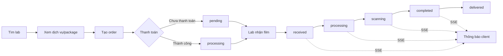

### 7.2 Marketplace order

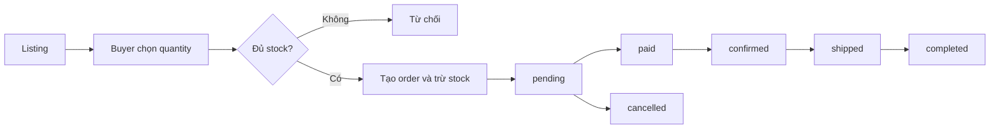

### 7.3 AI recommendation

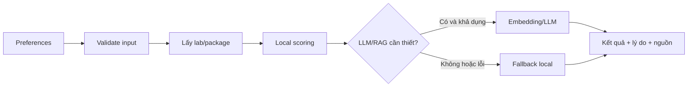

---

## 8. Non-Functional Requirements

- **NFR-01 Performance:** API đọc danh sách/chi tiết mục tiêu p95 dưới 500 ms trong tải bình thường, không tính thời gian provider ngoài.
- **NFR-02 Upload:** Xử lý ảnh phải bất đồng bộ hoặc giới hạn kích thước để không chặn event loop với file lớn.
- **NFR-03 Availability:** Khi AI provider hoặc payment provider lỗi, các chức năng không phụ thuộc phải tiếp tục hoạt động; AI phải có fallback rõ ràng.
- **NFR-04 Scalability:** Backend stateless; có thể chạy nhiều instance sau load balancer. SSE phải hỗ trợ timeout/reconnect.
- **NFR-05 Usability:** Giao diện responsive cho desktop/mobile, thông báo lỗi dễ hiểu, trạng thái loading/empty/error đầy đủ.
- **NFR-06 Accessibility:** Form có label, điều hướng bàn phím, tương phản đạt WCAG 2.1 AA cho các luồng chính.
- **NFR-07 Maintainability:** Tách route/service/model; cấu hình qua environment; API và trạng thái phải có tài liệu.
- **NFR-08 Observability:** Ghi log request id, lỗi, payment reference, AI fallback và các thay đổi trạng thái quan trọng; không log mật khẩu/token.
- **NFR-09 Compatibility:** Hỗ trợ các trình duyệt hiện đại và Node.js version được khóa trong CI.
- **NFR-10 Recovery:** PostgreSQL, file metadata và cấu hình production phải có backup; mục tiêu RPO/RTO cần chủ sản phẩm chốt trước production.
- **NFR-11 Localization:** UI phải hỗ trợ tiếng Việt; tiền tệ, ngày giờ và timezone phải cấu hình theo thị trường.

---

## 9. External Interface Requirements

### 9.1 Giao diện người dùng

Next.js cung cấp các màn hình chính: trang chủ, login/register, labs, lab detail, orders, lab dashboard, marketplace, community, events, upload, profile, admin, chatbot và recommendations. Mọi màn hình cần hiển thị kết quả API, lỗi xác thực và trạng thái mạng.

### 9.2 REST API

Base path hiện tại là `/api`. Các nhóm endpoint gồm:

| Nhóm | Chức năng |
|---|---|
| `/auth` | đăng ký, đăng nhập, profile, forgot password |
| `/film-labs` | danh sách và chi tiết lab |
| `/orders` | tạo, xem và cập nhật order |
| `/lab-management` | dashboard, service/package, orders, customers |
| `/marketplace` | listings, favorites, marketplace orders, reviews |
| `/community` | posts, comments |
| `/events` | workshops, photowalks, registrations, check-in |
| `/uploads` | upload, danh sách, xóa, share |
| `/ai` | recommendations, semantic search, chatbot/quality support |
| `/reviews`, `/messages`, `/transactions`, `/payments`, `/admin` | review, liên lạc, giao dịch, thanh toán và quản trị |

API dùng JSON, ngoại trừ upload dùng `multipart/form-data`. Lỗi tối thiểu phải có HTTP status và trường `error`.

### 9.3 Tích hợp ngoài

- PostgreSQL/Sequelize: dữ liệu giao dịch.
- Elasticsearch: semantic/search index, dự kiến production.
- OpenAI/Azure OpenAI: embedding/LLM, tùy chọn.
- Stripe hoặc Bank QR: thanh toán.
- AWS S3/blob storage: file ảnh, tùy chọn.
- SSE: cập nhật trạng thái order.
- Docker Compose: PostgreSQL, Elasticsearch và các service local.

---

## 10. Data Requirements

### 10.1 Thực thể chính

`users`, `film_labs`, `lab_services`, `lab_packages`, `orders`, `order_items`, `transactions`, `products`, `marketplace_orders`, `reviews`, `messages`, `posts`, `comments`, `uploads`, `favorites`, `workshops`, `photowalks`, `event_registrations` và `rag_documents`.

### 10.2 Quan hệ và toàn vẹn

- Một user có thể sở hữu nhiều lab, upload, order, product, post và registration.
- Một lab có nhiều service, package và order.
- Một order có nhiều order item và transaction.
- Một product có nhiều favorite, marketplace order và review.
- Một post có nhiều comment.
- Foreign key phải dùng UUID và hành vi xóa phải nhất quán với retention policy.
- Rating nằm trong 1..5; quantity, stock, price không được âm.
- Email là duy nhất; password chỉ lưu dạng hash.

### 10.3 Vòng đời và lưu trữ

- Dữ liệu giao dịch không xóa cứng nếu còn liên quan tài chính; dùng archive/soft delete khi cần.
- File ảnh cần lifecycle policy, giới hạn dung lượng và xóa file vật lý khi bản ghi hợp lệ bị xóa.
- AI document có source, title, content, metadata và embedding; phải lưu phiên bản/index timestamp khi dùng production.
- Dữ liệu cá nhân, tin nhắn và ảnh riêng tư phải được phân loại và giới hạn truy cập.

### 10.4 Đồng tiền và thời gian

Mọi giá trị tiền phải có currency rõ ràng, dùng kiểu số chính xác phù hợp thay vì float ở production. Thời gian lưu UTC; frontend hiển thị theo timezone người dùng.

---

## 11. AI Requirements

- **AI-01:** Nhận diện input gồm location, service type, film style, preferences, budget và lịch sử tùy chọn.
- **AI-02:** Xếp hạng lab theo địa điểm, rating, dịch vụ và khoảng giá; trả điểm và lý do có thể hiểu.
- **AI-03:** Chọn film stock dựa trên style và mục đích/chủ đề chụp.
- **AI-04:** Semantic search dùng embedding model được cấu hình và truy hồi tài liệu liên quan.
- **AI-05:** RAG chatbot chỉ nên trả lời dựa trên context truy hồi, nêu rõ khi không đủ thông tin và không tự khẳng định điều chưa biết.
- **AI-06:** Khi provider lỗi/không có API key, fallback local phải trả response hợp lệ và đánh dấu `fallback`.
- **AI-07:** AI không được tự tạo order, thanh toán, thay đổi stock hoặc thay đổi trạng thái nghiệp vụ.
- **AI-08:** Không gửi dữ liệu cá nhân/ảnh riêng tư tới provider ngoài nếu chưa có consent và cơ chế bảo vệ.
- **AI-09:** Lưu input/output cần tối thiểu hóa dữ liệu; có cơ chế xóa và không dùng dữ liệu người dùng để huấn luyện nếu chưa được cho phép.
- **AI-10:** Đánh giá chất lượng ảnh hiện tại là phân tích heuristic (brightness, contrast, sharpness, noise, colorfulness), không phải kết luận chất lượng nghệ thuật.
- **AI-11 (KPI dự kiến):** Đo hit rate đề xuất, độ liên quan RAG, latency, fallback rate và tỷ lệ phản hồi bị người dùng đánh dấu không hữu ích.

---

## 12. System Architecture

### 12.1 Kiến trúc logic

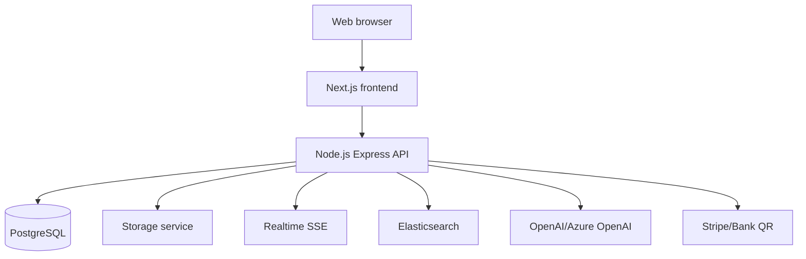

- **Presentation:** Next.js pages/components, auth token và gọi API.
- **Application:** Express routes, auth middleware, role authorization, domain services.
- **Persistence:** Sequelize models và PostgreSQL.
- **Search/AI:** local scoring, RAG documents, embedding/search provider.
- **Media:** local uploads trong development, S3/blob storage trong production.
- **Realtime:** SSE broadcast cho order updates.

### 12.2 Triển khai

Local dùng Docker Compose cho PostgreSQL/Elasticsearch và chạy frontend/backend riêng. Production có thể triển khai container trên Azure App Service, Azure Container Instances hoặc Kubernetes với managed database/search/storage.

---

## 13. Business Rules

- **BR-01:** Email tài khoản không trùng.
- **BR-02:** Mật khẩu không bao giờ trả về API hoặc lưu plaintext.
- **BR-03:** Photographer chỉ tạo order dưới user hiện tại.
- **BR-04:** Lab owner chỉ quản lý lab/order thuộc lab mình; admin có quyền toàn hệ thống.
- **BR-05:** Tổng order bằng tổng `quantity * unitPrice` của các item hợp lệ.
- **BR-06:** Order lab chỉ nhận status thuộc tập đã định; luồng xử lý chuẩn không được nhảy ngược.
- **BR-07:** Marketplace order không được tạo khi stock nhỏ hơn quantity; stock không âm.
- **BR-08:** Seller chỉ quản lý listing của mình; buyer/seller/admin mới được truy cập order liên quan.
- **BR-09:** Review rating phải từ 1 đến 5.
- **BR-10:** Bài viết chưa public không xuất hiện trong danh sách công khai.
- **BR-11:** Một người không được đăng ký cùng event type/event id nhiều lần.
- **BR-12:** Event không nhận đăng ký khi đã đủ capacity (bắt buộc hoàn thiện trước production).
- **BR-13:** Upload mặc định private; chỉ bật share khi owner yêu cầu.
- **BR-14:** AI chỉ tư vấn; mọi hành động giao dịch cần người dùng xác nhận.
- **BR-15:** Payment webhook phải idempotent và là nguồn xác nhận thanh toán.

---

## 14. Security Requirements

- **SEC-01:** Xác thực JWT với secret mạnh, cấu hình ngoài source code và thời hạn hết hạn.
- **SEC-02:** Mật khẩu băm bcrypt cost phù hợp; rate limit login/register/forgot-password.
- **SEC-03:** Phân quyền server-side bằng middleware và kiểm tra ownership ở từng resource.
- **SEC-04:** Validate và sanitize mọi input; dùng ORM parameterization, không nối SQL thủ công.
- **SEC-05:** CORS chỉ cho phép origin được cấu hình; production dùng HTTPS.
- **SEC-06:** Không trả stack trace, password hash, secret hoặc thông tin nhạy cảm trong lỗi API.
- **SEC-07:** Giới hạn kích thước/MIME của upload, đổi tên file an toàn, chống path traversal và kiểm tra malware.
- **SEC-08:** S3/object storage dùng private bucket và signed URL có hạn; secret chỉ ở secret manager/environment.
- **SEC-09:** Payment webhook xác minh chữ ký, chống replay và ghi audit.
- **SEC-10:** Bảo vệ dữ liệu riêng tư theo nguyên tắc least privilege; hỗ trợ xóa/tải dữ liệu theo chính sách pháp lý áp dụng.
- **SEC-11:** Audit log cho đăng nhập, thay đổi quyền, thanh toán, status order, xóa nội dung và thao tác admin.
- **SEC-12:** Thực hiện dependency scanning, SAST, backup restore test và penetration test trước production.

---

## 15. Acceptance Criteria

- **AC-01:** Người dùng mới đăng ký thành công, email trùng bị từ chối, đăng nhập trả JWT và profile không trả password.
- **AC-02:** Danh sách lab lọc đúng theo q/city/country/service/price/rating và chi tiết hiển thị services/packages/reviews.
- **AC-03:** Photographer tạo order hợp lệ nhận được order items, total price và trạng thái đúng; input không hợp lệ bị từ chối.
- **AC-04:** Lab owner không thể đọc/sửa order của lab khác; cập nhật trạng thái hợp lệ phát được SSE.
- **AC-05:** Marketplace không cho mua vượt stock; listing ownership và các trạng thái order được kiểm tra ở backend.
- **AC-06:** Bài viết private không lộ qua API public; người dùng xác thực có thể tạo/comment bài public.
- **AC-07:** Upload ảnh hợp lệ tạo quality metrics; file không hợp lệ bị chặn; user khác không xóa được upload.
- **AC-08:** AI trả đề xuất có lý do; khi thiếu provider hệ thống trả fallback và không làm hỏng luồng UI.
- **AC-09:** Sự kiện đăng ký không trùng và không vượt capacity trong điều kiện đồng thời.
- **AC-10:** CI chạy unit, integration, security và API contract tests; không có lỗi blocker/critical.
- **AC-11:** Các luồng chính hoạt động trên desktop/mobile và đạt yêu cầu accessibility đã chốt.
- **AC-12:** Production secrets không nằm trong repository; backup và khôi phục được kiểm thử.

---

## 16. Traceability Matrix

| Mục tiêu | Yêu cầu chính | Use case | Tiêu chí nghiệm thu |
|---|---|---|---|
| Tài khoản an toàn | FR-01..06, SEC-01..03 | UC-01 | AC-01 |
| Tìm và đặt lab | FR-07..15, BR-03..06 | UC-01 | AC-02, AC-03 |
| Vận hành lab | FR-16..20 | UC-02 | AC-04 |
| Thanh toán tin cậy | FR-21..24, BR-15, SEC-09 | UC-01 | AC-03, AC-12 |
| Mua bán thiết bị | FR-25..31, BR-07..09 | UC-03 | AC-05 |
| Cộng đồng/sự kiện | FR-32..37, BR-10..12 | Không riêng | AC-06, AC-09 |
| Quản lý ảnh | FR-38..42, BR-13, SEC-07..08 | UC-05 | AC-07 |
| Trợ lý AI | FR-43..47, AI-01..11 | UC-04 | AC-08 |
| Quản trị | FR-48..50, SEC-11 | Các UC | AC-10, AC-12 |
| Chất lượng nền tảng | NFR-01..11 | Tất cả | AC-10, AC-11, AC-12 |

---

## 17. Future Enhancements

1. Hoàn thiện Stripe/webhook, Bank QR reconciliation và refund.
2. OAuth 2.0, email verification, reset password thật và 2FA.
3. Marketplace shipping, escrow, dispute và seller verification.
4. Notification center, email/push notification và realtime chat.
5. Moderator role, report workflow, content moderation và audit dashboard.
6. Capacity locking, waitlist và calendar integration cho event.
7. Elasticsearch production index, ranking học từ hành vi và recommendation evaluation.
8. AI multimodal phân tích scan nâng cao, feedback loop và explainability tốt hơn.
9. S3 lifecycle, CDN, image variants, virus scanning và signed URL.
10. Multi-currency, thuế, hóa đơn và localization theo quốc gia.
11. Observability đầy đủ với metrics, traces, alerting, SLO/RPO/RTO rõ ràng.
12. Mobile application hoặc PWA cho photographer và lab owner.

---

## 18. Permission Matrix

Ký hiệu: **X** = được thực hiện; **O** = chỉ được thực hiện trên dữ liệu do mình sở hữu/liên quan; **R** = chỉ đọc; **-** = không được phép. Đây là quyền nghiệp vụ yêu cầu ở backend.

| Resource/action | Guest | Photographer | Lab owner | Seller | Admin |
|---|---:|---:|---:|---:|---:|
| Xem lab public, service, package | R | R | R | R | X |
| Tìm kiếm lab/listing/post/event public | R | R | R | R | X |
| Đăng ký/đăng nhập/profile của mình | - | O | O | O | O |
| Tạo order dịch vụ lab | - | X | X | X | X |
| Xem order lab của mình | - | O | O (lab mình) | O (nếu liên quan) | X |
| Cập nhật trạng thái order lab | - | - | O (lab mình) | - | X |
| Quản lý lab/service/package | - | - | O (lab mình) | - | X |
| Xem dashboard lab/customer | - | - | O (lab mình) | - | X |
| Tạo/sửa/xóa listing | - | - | - | O (listing mình) | X |
| Tạo marketplace order | - | X | X | X | X |
| Cập nhật marketplace order | - | O (buyer) | O (buyer/seller) | O (buyer/seller) | X |
| Yêu thích và đánh giá product | - | X | X | X | X |
| Tạo bài viết/bình luận | - | X | X | X | X |
| Quản lý nội dung của mình | - | O | O | O | X |
| Tạo/đăng ký/check-in event | - | X | X | X | X |
| Upload/xóa/chia sẻ ảnh của mình | - | O | O | O | X* |
| Dùng recommendation/chatbot/AI search | R | X | X | X | X |
| Quản trị người dùng/nội dung/audit | - | - | - | - | X |

`X*`: admin chỉ được truy cập ảnh theo chính sách hỗ trợ/audit đã phê duyệt, không mặc nhiên xem ảnh riêng tư.

## 19. Requirement Priority

| Mức | Ý nghĩa | Phạm vi chính |
|---|---|---|
| **P0** | Bắt buộc để hệ thống hoạt động an toàn và tạo giá trị cốt lõi; thiếu thì không nghiệm thu release | FR-01..04, FR-07..14, FR-16..20, FR-21, FR-24, FR-25..30, FR-32..35, FR-38..40, SEC-01..10 |
| **P1** | Quan trọng cho release production đầu tiên; có thể phát hành hạn chế nếu có kế hoạch xử lý | FR-05..06, FR-15, FR-22..23, FR-31, FR-36..37, FR-41..47, FR-48, NFR-01..11 |
| **P2** | Cải tiến, tối ưu hoặc năng lực mở rộng sau MVP | FR-49..50, AI-11, OAuth, moderation nâng cao, báo cáo nâng cao và các mục Future Enhancements |

### 19.1 Nguyên tắc ưu tiên

- Yêu cầu liên quan quyền truy cập, thanh toán, dữ liệu cá nhân và toàn vẹn stock không được hạ dưới P0/P1.
- Một FR “Hiện có” vẫn có thể là P1 nếu implementation hiện tại chưa đạt kiểm thử production.
- P0 phải có test chức năng và test quyền; P1 phải có kế hoạch hardening; P2 được quản lý trong product backlog.

## 20. FR Contract: Input → Validation → Output → Error

Bảng dưới đây là hợp đồng tối thiểu cho từng FR. `Input` là dữ liệu hoặc thao tác đầu vào; `Output` là kết quả thành công; `Error` là nhóm lỗi tối thiểu phải xử lý.

| ID | Ưu tiên | Input | Validation | Output | Error |
|---|---|---|---|---|---|
| FR-01 | P0 | name, email, password, role tùy chọn | Bắt buộc; email hợp lệ; role hợp lệ | User public + JWT | 400 thiếu/sai input; 409 email trùng |
| FR-02 | P0 | Email/password đăng ký hoặc đăng nhập | Email duy nhất; password được bcrypt hash | Token và user public | 401/409 xác thực hoặc trùng |
| FR-03 | P0 | Email, password | Đủ trường; so khớp hash | JWT, user public | 400 thiếu; 401 sai thông tin |
| FR-04 | P0 | JWT; name, phone, avatarUrl | JWT hợp lệ; name bắt buộc; ownership | Profile đã cập nhật | 401; 404 user; 400 input |
| FR-05 | P1 | Email reset | Email format; rate limit; không lộ tồn tại | Thông báo gửi reset chung | 400; 429; lỗi provider 503 |
| FR-06 | P1 | OAuth authorization code | State, redirect URI, provider token hợp lệ | Session/JWT liên kết user | 400/401/409 OAuth |
| FR-07 | P0 | labId hoặc request danh sách | UUID tồn tại; chỉ trả dữ liệu public | Lab detail/list + services/packages/reviews | 404; 500 |
| FR-08 | P0 | q, city, country, serviceType, price, rating | Chuẩn hóa chuỗi; price/rating là số hợp lệ | Danh sách lab đã lọc | 400 filter; 500 |
| FR-09 | P0 | name, serviceType, price, duration, description | Lab owner/admin; price không âm; lab thuộc quyền | LabService | 401/403; 400; 404 |
| FR-10 | P0 | title, price, description | Lab owner/admin; title; price không âm | LabPackage | 401/403; 400; 404 |
| FR-11 | P0 | labId, items, dueDate, paymentMethod | Auth; items không rỗng; lab/item tồn tại; quantity dương | Order + order items + checkout tùy chọn | 400; 404; 409; 500 |
| FR-12 | P0 | quantity, unitPrice trong items | Giá lấy từ server; quantity dương; transaction atomic | totalPrice và transaction | 400; 409; 500 rollback |
| FR-13 | P0 | JWT, orderId, status hoặc GET | User/role có quyền; status hợp lệ | Order list/detail/status | 401/403; 404; 400 status |
| FR-14 | P0 | order event, orderId | Event thuộc order; kết nối SSE hợp lệ | SSE update theo order | 401; disconnect; 503 |
| FR-15 | P1 | labId, serviceId/packageId | FK tồn tại; item thuộc lab; giá server-side | Order hợp lệ | 400; 404; 409 |
| FR-16 | P0 | JWT, lab scope, date window | Owner/admin; aggregate đúng phạm vi | Revenue/order/customer metrics | 401/403/404; 500 |
| FR-17 | P0 | JWT, lab scope | Ownership filter bắt buộc | Lab order list | 401/403/404 |
| FR-18 | P0 | orderId, next status | Owner/admin; status transition hợp lệ | Order đã cập nhật | 400 transition; 403; 404 |
| FR-19 | P0 | lab scope, customerId tùy chọn | Query chỉ trong lab scope | Customer summary/order history | 401/403/404; 500 |
| FR-20 | P1 | Actor, lab/order resource | Ownership hoặc admin check ở server | Allow/deny decision | 401/403/404 |
| FR-21 | P0 | orderId, amount, currency, method, status | Amount khớp server; enum; currency hợp lệ | Transaction record | 400; 409 duplicate; 500 |
| FR-22 | P1 | payment method Bank QR | Cấu hình QR/account đầy đủ | QR checkout data | 400 config; 503 provider |
| FR-23 | P1 | Checkout request/webhook | Signature, event id, idempotency | Payment session/updated transaction | 400 signature; 409 duplicate; 502/503 |
| FR-24 | P1 | Payment status callback | Chỉ provider xác nhận được đổi paid | Transaction/order status | 401/400 callback; 409 invalid transition |
| FR-25 | P0 | q, category, condition, price range | Chuẩn hóa và giới hạn range | Listing list | 400 filter; 500 |
| FR-26 | P0 | Listing fields, listingId | Seller/admin; ownership; price/stock hợp lệ | Created/updated/deleted listing | 401/403; 400; 404 |
| FR-27 | P0 | JWT, productId | Product tồn tại; toggle idempotent | Favorite hoặc removed result | 401; 404; 409 |
| FR-28 | P0 | productId, quantity, paymentMethod | Product tồn tại; quantity dương; stock đủ; atomic lock | MarketplaceOrder + stock update | 400; 404; 409 stock |
| FR-29 | P0 | orderId, status | Actor là buyer/seller/admin; transition hợp lệ | Updated marketplace order | 400; 403; 404 |
| FR-30 | P0 | productId, rating, reviewText | Auth; product tồn tại; rating 1..5 | Review | 400; 404; 409 policy |
| FR-31 | P1 | Concurrent marketplace orders | DB transaction/row lock; retry policy | Không oversell; một kết quả thành công | 409 stock; 503 deadlock/retry |
| FR-32 | P0 | Post query; title/body/tags/visibility; comment | Public filter; auth khi ghi; content non-empty | Posts/comments | 400; 401; 403; 404 |
| FR-33 | P0 | visibility, authorId | Enum; owner/admin access | Public/private/draft post | 400; 403 |
| FR-34 | P0 | Event fields; eventType/eventId | Auth; event tồn tại; duplicate check | Event/registration/check-in | 400; 404; 409 |
| FR-35 | P0 | Published event query | publishedAt khác null; order date | Upcoming event list | 500 |
| FR-36 | P1 | registration + capacity | Atomic count/lock; event published | Registration accepted/rejected | 409 full/duplicate; 404 |
| FR-37 | P1 | Post id, actor | Author/recipient/moderator/admin policy | Authorized post data | 403; 404 |
| FR-38 | P0 | multipart photo | Auth; one file; MIME/size policy | Upload record + URL | 400 file; 413 size; 500 storage |
| FR-39 | P0 | Image bytes | Decode được; giới hạn pixel; heuristic finite | Quality metrics + labels | 400 invalid image; 422 analysis |
| FR-40 | P0 | uploadId, share toggle | Owner/admin policy; record tồn tại | Upload list/deleted/shared record | 401/403; 404 |
| FR-41 | P1 | File name, MIME, size, content | Allowlist MIME/ext; max size; malware scan | Accepted/rejected upload | 400; 413; 415; 422 |
| FR-42 | P1 | Object key/access request | Private ACL; signed URL expiry | Time-limited media URL | 403; 404; 503 storage |
| FR-43 | P0 | history, location, price, preferences | Schema; numeric budget; bounded strings | Ranked recommendations + input | 400; 500 |
| FR-44 | P0 | Recommendation request | Local data available; deterministic fallback | Local recommendation + fallback flag | 503 only if no fallback |
| FR-45 | P1 | query, embeddings/documents | Query non-empty; provider/index health | Ranked RAG search results/source | 400; 502/503; fallback |
| FR-46 | P1 | chat message + optional context | Length/safety filter; context limit | Answer + source/fallback metadata | 400; 429; 502/503 |
| FR-47 | P1 | AI result metadata | Source/fallback/confidence schema | Explainable response + disclaimer | 422 missing metadata |
| FR-48 | P0 | Admin JWT; dashboard query | Role exactly admin; scope/filters | Admin metrics/data | 401/403; 500 |
| FR-49 | P2 | Admin action, target, reason | Admin role; target exists; audit reason | Moderation/account result + audit | 400; 403; 404; 409 |
| FR-50 | P2 | page, limit, filters, export format | Bounds; authorized fields; async export | Paginated data/export job | 400; 403; 413; 500 |

## 21. UI Requirements

- **UI-01:** Các màn hình chính phải gồm navigation, trạng thái đăng nhập, loading, empty, success và error rõ ràng.
- **UI-02:** Luồng đăng ký/đăng nhập có label, validation tại form, thông báo lỗi không tiết lộ thông tin nhạy cảm và redirect theo role.
- **UI-03:** Trang lab có search/filter, kết quả có tên, vị trí, rating, giá/dịch vụ và link tới detail; filter giữ được khi refresh nếu phù hợp.
- **UI-04:** Lab detail hiển thị services/packages/reviews và CTA đặt hàng; không cho submit khi thiếu item hoặc input invalid.
- **UI-05:** Order page hiển thị mã đơn, lab, items, tổng tiền, payment state, status timeline và tracking code; SSE update không làm mất dữ liệu form.
- **UI-06:** Lab dashboard hiển thị metric cards, bảng order, bộ lọc và action status chỉ khi user có quyền.
- **UI-07:** Marketplace có listing grid/list, search/filter, detail, quantity guard, favorite state, seller info và order state.
- **UI-08:** Community phân biệt public/private/draft, hiển thị author/time/tags, comment form và empty/error state.
- **UI-09:** Event page hiển thị thời gian, địa điểm, capacity/availability, trạng thái registration và ngăn double-submit.
- **UI-10:** Upload page chấp nhận file hợp lệ, hiển thị progress, preview an toàn, quality labels, share toggle và delete confirmation.
- **UI-11:** AI page hiển thị input, loading, kết quả, lý do, nguồn, fallback/disclaimer và lỗi provider; không hiển thị confidence giả nếu backend không trả.
- **UI-12:** Admin page có bảng có phân trang, confirmation cho thao tác phá hủy và thông tin audit.
- **UI-13:** Responsive từ mobile đến desktop; keyboard focus, semantic label, alt text và WCAG 2.1 AA cho luồng chính.
- **UI-14:** Không lưu hoặc hiển thị password/token; client phải xử lý hết hạn JWT bằng cách yêu cầu đăng nhập lại.

## 22. Data Dictionary

| Entity/field | Kiểu | Bắt buộc | Quy tắc/ý nghĩa |
|---|---|---:|---|
| `users.id` | UUID | Có | Khóa chính |
| `users.email` | String | Có | Unique, email hợp lệ |
| `users.passwordHash` | String | Có | Bcrypt hash, không public |
| `users.role` | Enum | Có | photographer/lab_owner/seller/admin |
| `film_labs.ownerId` | UUID | Có | FK tới users |
| `film_labs.rating` | Decimal | Có | Điểm trung bình, không âm, tối đa 5 |
| `lab_services.price` | Decimal | Có | Giá không âm; không nhận giá client khi checkout |
| `lab_packages.price` | Decimal | Có | Giá package không âm |
| `orders.id` | UUID | Có | Mã order |
| `orders.status` | Enum | Có | pending/processing/completed/cancelled; luồng vận hành mở rộng cần thống nhất |
| `orders.totalPrice` | Decimal | Có | Tổng server-side, có currency |
| `orders.trackingCode` | String | Không | Mã theo dõi của lab |
| `order_items.quantity` | Integer | Có | Số nguyên dương |
| `order_items.unitPrice` | Decimal | Có | Snapshot giá tại thời điểm đặt |
| `transactions.status` | Enum | Có | pending/succeeded/failed/refunded |
| `transactions.providerReference` | String | Không | Idempotency/provider reference |
| `products.stock` | Integer | Có | Số lượng tồn không âm |
| `marketplace_orders.status` | Enum | Có | pending/paid/confirmed/shipped/completed/cancelled |
| `reviews.rating` | Integer | Có | 1..5 |
| `posts.visibility` | Enum | Có | public/private/draft |
| `uploads.url` | String | Có | URL object; production nên signed URL |
| `uploads.quality` | JSONB | Không | brightness/contrast/sharpness/noise/colorfulness/labels |
| `event_registrations.status` | Enum | Có | registered/checked_in/cancelled |
| `rag_documents.embedding` | JSONB | Không | Vector/embedding do provider tạo |

**Quy ước dữ liệu:** UUID cho định danh; timestamp lưu UTC; tiền dùng Decimal/Numeric ở production; secret/password không được đưa vào response, log hoặc AI context.

## 23. Error Handling

### 23.1 HTTP contract

Mọi lỗi API trả JSON tối thiểu:

```json
{
  "error": {
    "code": "VALIDATION_ERROR",
    "message": "Input is invalid",
    "requestId": "req-...",
    "details": []
  }
}
```

Trong giai đoạn tương thích với API hiện tại, trường `error` dạng string có thể được giữ lại, nhưng contract production phải chuẩn hóa thành object.

| Status | Code | Khi dùng | UI expectation |
|---:|---|---|---|
| 400 | VALIDATION_ERROR | Thiếu/sai input, enum hoặc filter | Hiển thị lỗi cạnh field |
| 401 | UNAUTHENTICATED | Thiếu/hết hạn JWT, sai credential | Yêu cầu đăng nhập lại |
| 403 | FORBIDDEN | Không đủ role/ownership | Hiển thị không có quyền |
| 404 | NOT_FOUND | Resource không tồn tại hoặc không được expose | Hiển thị not found |
| 409 | CONFLICT | Trùng email, duplicate, stock/capacity/state conflict | Giữ form và yêu cầu refresh |
| 413 | PAYLOAD_TOO_LARGE | File/request vượt giới hạn | Nêu giới hạn cho người dùng |
| 415 | UNSUPPORTED_MEDIA_TYPE | MIME không được phép | Yêu cầu file khác |
| 422 | UNPROCESSABLE_ENTITY | File/AI input không thể phân tích | Cho phép thử lại |
| 429 | RATE_LIMITED | Vượt rate limit/provider quota | Hiển thị retry-after |
| 500 | INTERNAL_ERROR | Lỗi ngoài dự kiến | Không lộ stack trace; ghi log |
| 502/503 | DEPENDENCY_UNAVAILABLE | Payment/storage/AI/search lỗi | Fallback hoặc thử lại |

### 23.2 Nguyên tắc xử lý

- Validate ở boundary trước khi gọi database/provider.
- Lỗi tạo order/payment phải rollback dữ liệu liên quan hoặc đánh dấu trạng thái rõ ràng; không để order “đã thanh toán” chỉ do client.
- Retry chỉ áp dụng cho lỗi tạm thời và request idempotent; không retry mù cho thanh toán hay giảm stock.
- Mỗi lỗi production có `requestId`; log có context nhưng loại bỏ password, JWT, API key và dữ liệu ảnh riêng tư.
- Frontend phải chống double-submit, giữ input khi lỗi có thể sửa và cung cấp action retry khi dependency tạm thời lỗi.

## 24. State Transition

### 24.1 Film lab order

| Trạng thái hiện tại | Trạng thái kế tiếp hợp lệ | Actor |
|---|---|---|
| `pending` | `processing`, `cancelled` | Payment service/lab owner/admin theo policy |
| `processing` | `received`, `cancelled` | Lab owner/admin |
| `received` | `processing`, `cancelled` | Lab owner/admin |
| `scanning` | `completed`, `cancelled` | Lab owner/admin |
| `completed` | `delivered` | Lab owner/admin |
| `delivered` | Không chuyển tiếp | - |
| `cancelled` | Không chuyển tiếp | - |

Quy ước hiện tại có hai enum khác nhau: model `orders` dùng `pending/processing/completed/cancelled`, trong khi route lab-management dùng thêm `new/received/scanning/delivered`. Trước production phải hợp nhất thành một state machine và migration dữ liệu; không được coi việc chấp nhận mọi status là transition hợp lệ.

### 24.2 Marketplace order

| Trạng thái hiện tại | Trạng thái kế tiếp hợp lệ | Actor |
|---|---|---|
| `pending` | `paid`, `cancelled` | Buyer/payment |
| `paid` | `confirmed`, `cancelled` | Seller/admin |
| `confirmed` | `shipped`, `cancelled` | Seller/admin |
| `shipped` | `completed` | Buyer/admin theo delivery policy |
| `completed` | Không chuyển tiếp | - |
| `cancelled` | Không chuyển tiếp | - |

Thanh toán thất bại không phải là transition hợp lệ của marketplace order nếu chưa có transaction/payment record tương ứng. Việc trừ stock phải atomic với tạo order; hủy đơn phải có policy hoàn stock.

### 24.3 Event registration

| Trạng thái hiện tại | Trạng thái kế tiếp hợp lệ | Actor |
|---|---|---|
| Không tồn tại | `registered` | Người dùng xác thực, nếu event public và còn capacity |
| `registered` | `checked_in`, `cancelled` | Người dùng/organizer/admin theo policy |
| `cancelled` | `registered` | Chỉ khi policy cho phép và còn capacity |
| `checked_in` | Không chuyển tiếp | - |

Mỗi cặp `(userId, eventType, eventId)` chỉ có một registration đang hoạt động. Count capacity và tạo registration phải nằm trong transaction hoặc cơ chế lock chống đăng ký vượt chỗ.

## 25. Outline Coverage and Additional Specification

Phần này bổ sung các nội dung còn thiếu khi đối chiếu với outline mở rộng. Các yêu cầu chi tiết trước đó vẫn giữ nguyên mã `FR/NFR/AI` để không làm gãy traceability.

### 25.1 Introduction bổ sung

- **1.1 Purpose:** Xác định yêu cầu để xây dựng, kiểm thử và nghiệm thu Film Lab Ecosystem.
- **1.2 Scope:** Bao phủ customer platform, lab operations, marketplace, community, media và AI.
- **1.3 Intended Audience:** Product owner, developer, QA, vận hành lab, seller và admin.
- **1.4 Definitions & Glossary:** Xem Phụ lục C.
- **1.5 References:** README, architecture, database schema và source code route/model.
- **1.6 Document Conventions:** `FR`/`NFR`/`AI` là mã yêu cầu; P0/P1/P2 là độ ưu tiên; “Hiện có” và “Dự kiến” là trạng thái triển khai.

### 25.2 Overall Description bổ sung

- **Product perspective:** Nền tảng web client-server, backend REST API, PostgreSQL và các adapter payment/storage/search/AI.
- **Product functions:** Authentication, profile, lab discovery, booking/order/payment, lab management, marketplace, community, event, archive/upload, recommendation, chatbot, image analysis, notification và admin.
- **User classes:** Guest, Photographer, Lab Owner, Seller và Admin; Moderator là vai trò tương lai.
- **Operating environment:** Browser hiện đại trên desktop/mobile; frontend Next.js; backend Node.js/Express; PostgreSQL; Docker Compose cho local; HTTPS và managed services cho production.
- **Constraints:** Phụ thuộc JWT secret, database URL, giới hạn provider, storage quota, payment configuration và quy định bảo vệ dữ liệu.
- **Assumptions/dependencies:** Đã quy định tại mục 2.4; provider ngoài có thể unavailable và phải có fallback phù hợp.

### 25.3 Context Diagram

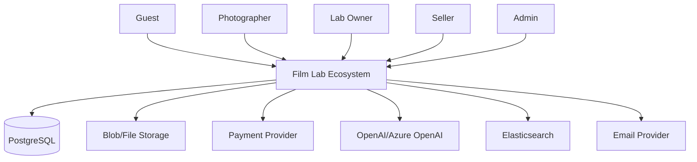

### 25.4 Mapping các nhóm Functional Requirements

| Nhóm outline | Mã yêu cầu |
|---|---|
| Authentication | FR-01..06 |
| User Profile | FR-04 |
| Film Lab / Lab Services | FR-07..10 |
| Booking / Order | FR-11..20 |
| Payment | FR-21..24 |
| Lab Management | FR-16..20 |
| Marketplace | FR-25..31 |
| Community | FR-32..33 |
| Events | FR-34..37 |
| Upload / Digital Film Archive | FR-38..42; archive là lớp lưu trữ và metadata của upload |
| AI Recommendation | FR-43..45 |
| AI Chatbot / Image Analysis | FR-46..47; FR-39 |
| Notification | FR-14 và SSE; notification đa kênh là P2 |
| Admin | FR-48..50 |

## 26. Use Case Catalogue UC-01 đến UC-29

| ID | Use case | Actor chính | Kết quả |
|---|---|---|---|
| UC-01 | Đăng ký tài khoản | Guest | User và JWT được tạo |
| UC-02 | Đăng nhập | Tất cả user | Session/JWT hợp lệ |
| UC-03 | Lấy/cập nhật profile | User | Profile được đọc hoặc cập nhật |
| UC-04 | Reset password | User | Reset token/email hoặc thông báo an toàn |
| UC-05 | OAuth login | User | Tài khoản liên kết provider |
| UC-06 | Tìm kiếm film lab | Guest/Photographer | Danh sách lab theo query/filter |
| UC-07 | Xem lab detail | Guest/Photographer | Services, packages, reviews |
| UC-08 | So sánh lab | Photographer | Bảng so sánh giá, rating, thời lượng |
| UC-09 | Quản lý lab profile | Lab Owner | Lab profile được tạo/sửa |
| UC-10 | Quản lý lab service | Lab Owner | Service được tạo/sửa/ẩn |
| UC-11 | Quản lý package | Lab Owner | Package được tạo/sửa/ẩn |
| UC-12 | Tạo booking/order | Photographer | Order và order items được tạo |
| UC-13 | Thanh toán order | Photographer/Payment | Transaction được xác nhận |
| UC-14 | Theo dõi order | Photographer | Timeline/status được cập nhật |
| UC-15 | Xử lý order tại lab | Lab Owner | Film đi qua state machine |
| UC-16 | Xem lab dashboard | Lab Owner | Metrics và customer summary |
| UC-17 | Upload scan/ảnh | Photographer | File và quality metadata được lưu |
| UC-18 | Quản lý digital film archive | Photographer | Xem, xóa, chia sẻ archive item |
| UC-19 | Đăng listing | Seller | Product listing public |
| UC-20 | Tìm/xem listing | Guest/Buyer | Sản phẩm và seller info |
| UC-21 | Yêu thích listing | Buyer | Favorite được toggle |
| UC-22 | Mua sản phẩm | Buyer | Marketplace order và stock update |
| UC-23 | Xử lý giao dịch marketplace | Buyer/Seller | Order chuyển paid đến completed/cancelled |
| UC-24 | Đánh giá product/lab | User | Review 1..5 được lưu |
| UC-25 | Tạo bài viết/bình luận | User | Community content được publish |
| UC-26 | Tạo/tham gia event | User/Organizer | Event và registration được quản lý |
| UC-27 | Nhận recommendation | User | Ranked lab/package/film stock |
| UC-28 | Hỏi chatbot/semantic search | User | Answer/search result có source/fallback |
| UC-29 | Quản trị hệ thống | Admin | User, content, report và audit được quản lý |

## 27. Use Case, Activity and State Diagrams

### 27.1 Use Case Diagram

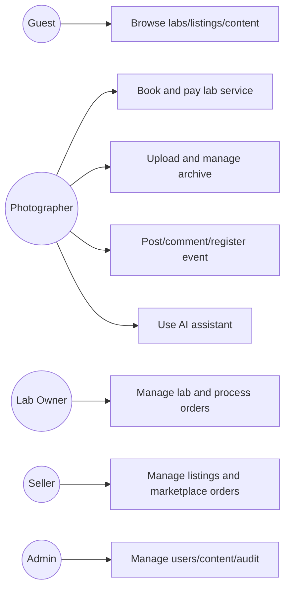

### 27.2 Activity Diagram: Booking

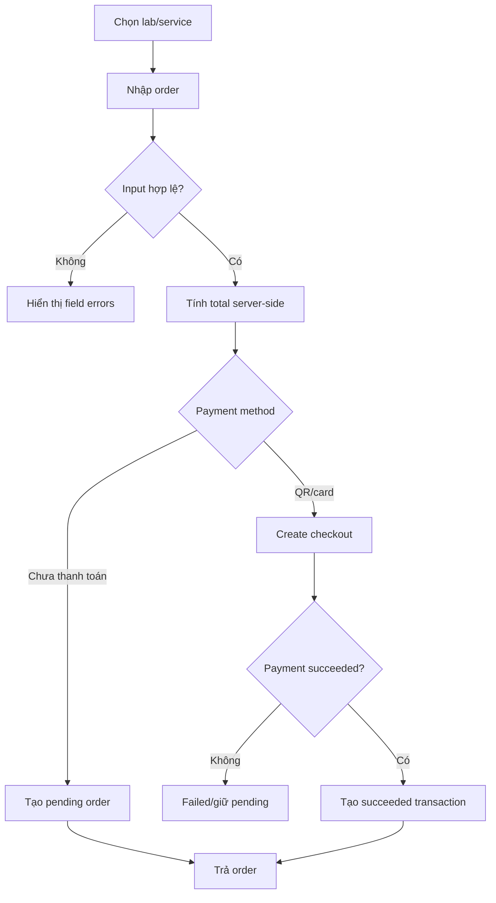

### 27.3 State Diagram: Event Registration

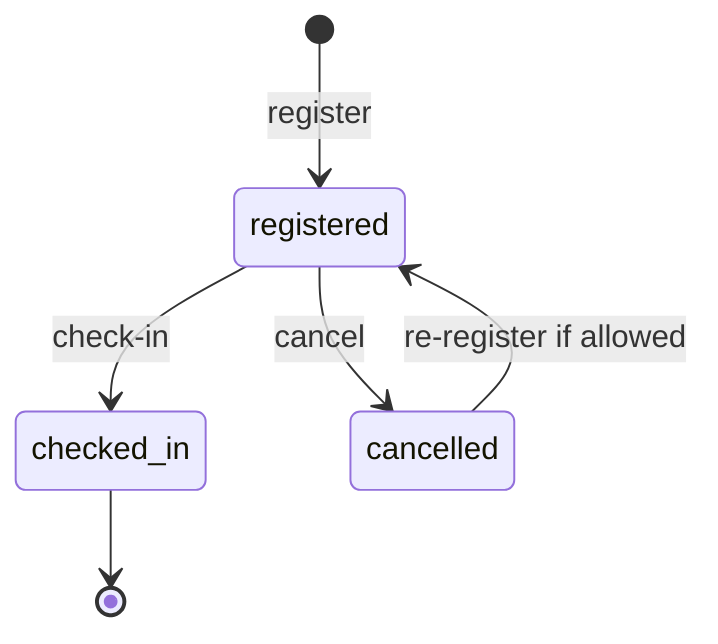

State details và transition guards được quy định tại mục 24.

## 28. UI/UX Requirements

Yêu cầu UI đầy đủ nằm ở mục 21. Bổ sung acceptance theo screen:

| Screen group | Bắt buộc hiển thị | Guard chính |
|---|---|---|
| Auth/Profile | form, validation, session state | Guest/user state |
| Labs/Booking | filter, detail, price, CTA | item/lab validity |
| Orders/Lab dashboard | status timeline, metrics, actions | role/ownership |
| Marketplace | stock, seller, quantity, order state | stock/actor |
| Community/Events | visibility, capacity, registration | public/access/capacity |
| Upload/Archive | preview, quality, share/delete | file type/owner |
| AI/Admin | source, fallback, audit, confirmation | provider/admin role |

## 29. API Requirements

- API version hiện tại dùng `/api` và JSON; upload dùng `multipart/form-data`.
- Mọi protected endpoint phải nhận `Authorization: Bearer <JWT>`.
- Response thành công dùng resource object/list; response lỗi dùng contract tại mục 23.
- List endpoint production phải hỗ trợ `page`, `limit`, `sort` và filter ổn định.
- POST tạo resource trả HTTP 201; GET trả 200; PATCH/PUT trả 200; delete thành công trả 200/204.
- API phải có request id, timeout provider, rate limit và OpenAPI/contract test trước production.

## 30. Data and Deployment Architecture

### 30.1 ERD khái quát

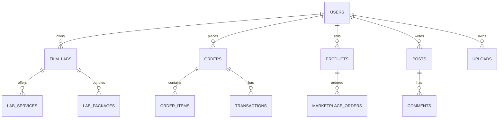

### 30.2 Data validation and lifecycle

Validation, retention, privacy, UTC timestamp và tiền tệ được quy định tại mục 22.2–22.4 và mục 23. Dữ liệu giao dịch, upload, AI document và audit phải có retention policy được chủ sản phẩm phê duyệt.

### 30.3 Deployment Architecture

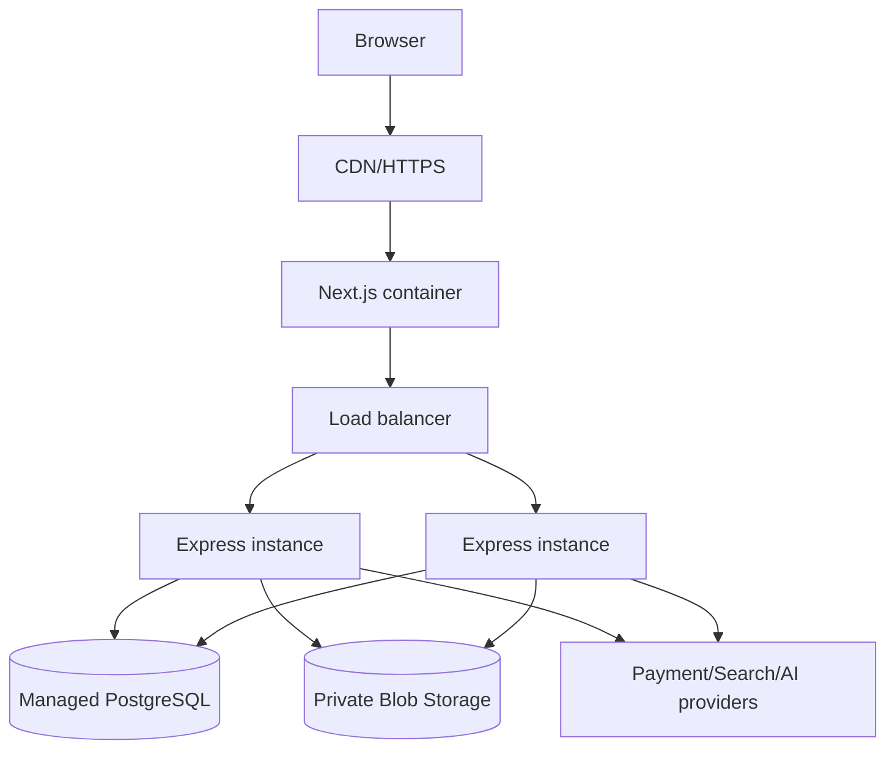

Local deployment dùng Docker Compose; production yêu cầu private network, secret manager, TLS, managed PostgreSQL, backup và monitoring.

## 31. Testing Requirements

- **TEST-01 Unit:** Test scoring AI, validators, state transition, total price, permission predicate và image quality labels.
- **TEST-02 Integration:** Test route với PostgreSQL test database, auth middleware, ownership, transaction rollback và SSE.
- **TEST-03 Contract:** Kiểm tra status code, schema JSON, error code, pagination và backward compatibility API.
- **TEST-04 E2E:** Bao phủ đăng ký -> tìm lab -> đặt -> thanh toán/fallback -> theo dõi; upload -> archive; listing -> mua; post -> comment; event -> check-in.
- **TEST-05 Security:** SAST, dependency scan, rate-limit test, IDOR/ownership test, upload abuse, secret scan và webhook signature test.
- **TEST-06 Performance:** Load test list/search/order, concurrent stock/capacity, SSE reconnect và upload size limit.
- **TEST-07 AI evaluation:** Golden set cho recommendation/RAG, hallucination review, fallback, prompt injection và provider timeout.
- **TEST-08 Acceptance:** Mỗi P0 có test pass và liên kết AC; P1 có test hoặc ticket hardening; P2 có backlog owner.

## 32. Detailed Use Case Specifications

Các use case dưới đây là đặc tả chi tiết cho những luồng có rủi ro hoặc giá trị nghiệp vụ cao. Các UC còn lại được mô tả trong catalogue tại mục 26 và phải tuân theo FR Contract tại mục 20.

### UC-01 - Đăng ký tài khoản

- **Actor:** Guest.
- **Pre-condition:** Chưa đăng nhập; email chưa được sử dụng.
- **Input:** `name`, `email`, `password`, `role` tùy chọn.
- **Main flow:** Mở Register -> nhập dữ liệu -> submit -> validate -> kiểm tra email -> bcrypt hash password -> tạo user -> phát JWT -> redirect theo role.
- **Alternative flow:** Email trùng trả 409; thiếu/sai dữ liệu trả 400; lỗi database trả 500.
- **Post-condition:** User được tạo; password không xuất hiện trong response.
- **Related:** FR-01..03, SEC-01..02, AC-01, TC-AUTH-001.

### UC-12 - Tạo booking/order dịch vụ lab

- **Actor:** Photographer.
- **Pre-condition:** Đã đăng nhập; lab và service/package đang tồn tại.
- **Input:** `labId`, `items[]`, `quantity`, `dueDate`, `paymentMethod`.
- **Main flow:** Chọn lab -> chọn item -> nhập số lượng -> hệ thống lấy giá từ database -> validate ownership/FK/quantity -> tính tổng -> tạo order và order items trong transaction -> tạo checkout nếu có -> trả order.
- **Alternative flow:** Lab/item không tồn tại trả 404; item rỗng hoặc quantity không hợp lệ trả 400; xung đột transaction trả 409 và rollback.
- **Post-condition:** Order ở `pending` hoặc `processing`; tổng tiền là giá server-side.
- **Related:** FR-11..15, BR-03..06, AC-03, TC-ORDER-001.

### UC-13 - Thanh toán order

- **Actor:** Photographer; Payment Provider.
- **Pre-condition:** Order tồn tại, chưa thanh toán và user có quyền.
- **Input:** `orderId`, payment method, provider callback/webhook.
- **Main flow:** Client yêu cầu checkout -> backend tạo payment session/QR -> provider xử lý -> backend xác minh webhook -> kiểm tra idempotency -> lưu transaction -> cập nhật order.
- **Alternative flow:** Provider từ chối -> transaction `failed`; webhook sai chữ ký -> 400; event trùng -> trả kết quả idempotent, không tạo giao dịch thứ hai.
- **Post-condition:** Chỉ webhook/provider hợp lệ mới được xác nhận `succeeded`.
- **Related:** FR-21..24, BR-15, SEC-09, TC-PAYMENT-001.

### UC-15 - Lab xử lý đơn

- **Actor:** Lab Owner.
- **Pre-condition:** Order thuộc lab của owner.
- **Input:** `orderId`, `nextStatus`.
- **Main flow:** Mở dashboard -> chọn order -> chọn trạng thái kế tiếp -> kiểm tra role/ownership/transition -> lưu status -> phát SSE -> hiển thị timeline.
- **Alternative flow:** Không thuộc lab trả 403; order không tồn tại trả 404; transition không hợp lệ trả 400/409.
- **Post-condition:** Chỉ state hợp lệ được lưu và có audit event.
- **Related:** FR-17..20, BR-06, AC-04, TC-LAB-003.

### UC-17 - Upload và phân tích ảnh

- **Actor:** Photographer.
- **Pre-condition:** Đã đăng nhập; file nằm trong allowlist.
- **Input:** Multipart field `photo`, MIME type, file size.
- **Main flow:** Chọn file -> client hiển thị preview/progress -> backend kiểm tra MIME/size -> decode ảnh -> tính quality metrics -> lưu storage và metadata -> trả quality labels.
- **Alternative flow:** File quá lớn trả 413; MIME không hỗ trợ trả 415; ảnh không đọc được trả 422; storage lỗi trả 503.
- **Post-condition:** Upload private mặc định; owner có thể bật share.
- **Related:** FR-38..42, AI-10, AC-07, TC-UPLOAD-001.

### UC-22 - Mua sản phẩm marketplace

- **Actor:** Buyer.
- **Pre-condition:** Product tồn tại và stock đủ.
- **Input:** `productId`, `quantity`, `paymentMethod`.
- **Main flow:** Xem listing -> nhập quantity -> backend khóa/đọc stock -> tính total -> tạo marketplace order và giảm stock atomic -> trả order.
- **Alternative flow:** Quantity không hợp lệ trả 400; product không tồn tại trả 404; stock không đủ trả 409; deadlock retry có giới hạn.
- **Post-condition:** Stock không âm; một yêu cầu cạnh tranh chỉ thành công khi còn hàng.
- **Related:** FR-28..31, BR-07..08, AC-05, TC-MARKET-002.

### UC-27 - Nhận recommendation

- **Actor:** User.
- **Pre-condition:** Recommendation endpoint hoạt động; dữ liệu input có thể rỗng ở trường tùy chọn.
- **Input:** Location, service type, film style, budget, history.
- **Main flow:** Nhập preference -> validate -> lấy lab/package -> local scoring -> bổ sung AI/provider nếu có -> trả danh sách xếp hạng, score, reason, source/fallback.
- **Alternative flow:** Provider lỗi thì local fallback; input sai trả 400; không có dữ liệu trả danh sách rỗng có giải thích.
- **Post-condition:** Không tạo order hoặc thay đổi dữ liệu giao dịch.
- **Related:** FR-43..45, AI-01..07, AC-08, TC-AI-001.

### UC-28 - Hỏi chatbot/semantic search

- **Actor:** User.
- **Pre-condition:** Có query không rỗng; RAG documents/index có thể có hoặc không.
- **Input:** `query`, conversation context tùy chọn.
- **Main flow:** Nhận query -> kiểm tra độ dài/safety -> embedding/search -> chọn context -> gọi LLM -> lọc response -> trả answer, source và fallback.
- **Alternative flow:** Không có provider trả fallback; provider timeout trả 503 hoặc câu trả lời an toàn; prompt injection bị loại bỏ/giảm quyền.
- **Post-condition:** Câu trả lời không được tự thực hiện giao dịch.
- **Related:** FR-45..47, AI-04..09, TC-AI-002.

### UC-29 - Quản trị hệ thống

- **Actor:** Admin.
- **Pre-condition:** JWT hợp lệ và role `admin`.
- **Input:** Target resource, action, reason, filters.
- **Main flow:** Mở admin dashboard -> tìm resource -> xem context -> xác nhận action -> backend authorize -> ghi thay đổi và audit log -> trả kết quả.
- **Alternative flow:** Sai role trả 403; target không tồn tại trả 404; action xung đột trả 409.
- **Post-condition:** Action có actor, timestamp, target và reason trong audit log.
- **Related:** FR-48..50, SEC-11, AC-10, TC-ADMIN-001.

## 33. Notification Requirements

- **NOTI-01 (P1):** Photographer nhận thông báo khi order được `received`, `processing`, `scanning`, `completed` hoặc `delivered`.
- **NOTI-02 (P1):** Lab Owner nhận thông báo khi có booking/order mới hoặc payment thành công.
- **NOTI-03 (P1):** Seller nhận thông báo khi có marketplace order mới, payment thành công hoặc buyer hủy đơn.
- **NOTI-04 (P1):** Người dùng nhận thông báo khi đăng ký event thành công, event sắp diễn ra hoặc có comment/reply liên quan.
- **NOTI-05 (P0):** Mỗi notification phải gắn `recipientId`, `type`, `entityType`, `entityId`, `readAt`, `createdAt` và payload tối thiểu.
- **NOTI-06 (P0):** Notification không được gửi cho user không có quyền xem entity liên quan.
- **NOTI-07 (P1):** SSE dùng cho order update gần realtime; notification email/push là adapter có thể bật theo cấu hình.
- **NOTI-08 (P1):** Gửi notification phải idempotent theo event key, retry lỗi tạm thời và không làm rollback giao dịch chính.

### Notification payload mẫu

```json
{
  "type": "ORDER_STATUS_CHANGED",
  "recipientId": "user-uuid",
  "entityType": "order",
  "entityId": "order-uuid",
  "title": "Đơn hàng đã được tiếp nhận",
  "readAt": null,
  "createdAt": "2026-08-26T10:00:00Z"
}
```

## 34. API Detailed Specification

### POST `/api/orders`

**Request**

```json
{
  "labId": "lab-uuid",
  "items": [
    { "itemType": "service", "itemId": "service-uuid", "quantity": 1 }
  ],
  "paymentMethod": "bank_qr",
  "dueDate": "2026-09-01T00:00:00Z"
}
```

**Response 201**

```json
{
  "id": "order-uuid",
  "status": "pending",
  "totalPrice": 250000,
  "currency": "VND",
  "items": [],
  "checkout": { "provider": "bank_qr", "qrUrl": "https://example.invalid/qr" }
}
```

**Errors:** `400 VALIDATION_ERROR`, `401 UNAUTHENTICATED`, `404 NOT_FOUND`, `409 CONFLICT`, `503 DEPENDENCY_UNAVAILABLE`.

### POST `/api/marketplace/orders`

**Request**

```json
{ "productId": "product-uuid", "quantity": 1, "paymentMethod": "bank_qr" }
```

**Response 201:** Marketplace order gồm `id`, `buyerId`, `sellerId`, `productId`, `quantity`, `totalPrice`, `status` và `createdAt`.

**Errors:** `400 VALIDATION_ERROR`, `401 UNAUTHENTICATED`, `404 NOT_FOUND`, `409 STOCK_CONFLICT`.

### POST `/api/ai/recommendations`

**Request**

```json
{
  "location": { "city": "Ha Noi", "country": "Vietnam" },
  "price": { "minPrice": 100000, "maxPrice": 300000 },
  "preferences": { "serviceType": "Scanning", "filmStyle": "color", "budget": 300000 }
}
```

**Response 200:** `{ "recommendations": [], "filmStock": {}, "fallback": false, "message": "..." }`.

**Errors:** `400 VALIDATION_ERROR`, `429 RATE_LIMITED`, `503 DEPENDENCY_UNAVAILABLE` khi không có fallback.

### POST `/api/uploads`

Request là `multipart/form-data` với field `photo`. Response 201 gồm `id`, `url`, `mimeType`, `size`, `quality` và `shared: false`. Errors gồm `400`, `401`, `413`, `415`, `422`, `503`.

## 35. Requirement-to-Test Traceability

| Requirement | Use case | Acceptance | Test case |
|---|---|---|---|
| FR-01..03 | UC-01/02 | AC-01 | TC-AUTH-001, TC-AUTH-002 |
| FR-07..08 | UC-06/07 | AC-02 | TC-LAB-001 |
| FR-11..15 | UC-12 | AC-03 | TC-ORDER-001, TC-ORDER-002 |
| FR-18..20 | UC-15 | AC-04 | TC-LAB-003 |
| FR-21..24 | UC-13 | AC-03 | TC-PAYMENT-001, TC-PAYMENT-002 |
| FR-28..31 | UC-22/23 | AC-05 | TC-MARKET-002, TC-MARKET-003 |
| FR-32..37 | UC-25/26 | AC-06, AC-09 | TC-COMMUNITY-001, TC-EVENT-001 |
| FR-38..42 | UC-17/18 | AC-07 | TC-UPLOAD-001, TC-UPLOAD-002 |
| FR-43..47 | UC-27/28 | AC-08 | TC-AI-001, TC-AI-002 |
| FR-48..50 | UC-29 | AC-10 | TC-ADMIN-001 |
| SEC-01..12 | Tất cả protected UC | AC-01, AC-04, AC-12 | TC-SEC-001..TC-SEC-012 |

Quy ước: test case phải có precondition, input, expected result, actual result, evidence, status và link tới requirement.

## 36. Technology Stack

| Layer | Technology | Vai trò |
|---|---|---|
| Frontend | Next.js/React | Web UI và client routing |
| Backend | Node.js + Express | REST API và middleware |
| ORM | Sequelize | Model và truy vấn PostgreSQL |
| Database | PostgreSQL | Dữ liệu giao dịch và người dùng |
| Search | Elasticsearch | Search/semantic index tùy môi trường |
| Authentication | JWT + bcrypt | Session/API authentication |
| Storage | Local filesystem/S3/Azure Blob | Ảnh và media |
| AI | OpenAI/Azure OpenAI + local fallback | LLM, embedding, recommendation |
| Realtime | Server-Sent Events | Order status update |
| Containerization | Docker + Docker Compose | Local và deployment packaging |
| Testing | Jest/Supertest/Playwright (dự kiến) | Unit, API integration, E2E |
| CI/CD | GitHub Actions (dự kiến) | Test, scan và build |

Docker Desktop là công cụ chạy container cho development, không phải database. Database của hệ thống là PostgreSQL.

## 37. Deployment Environments

| Environment | Frontend | Backend | Database | AI/External services |
|---|---|---|---|---|
| Development | Local Next.js | Local Node.js | Docker PostgreSQL | Mock/local fallback hoặc provider dev |
| Testing | Container/CI build | Container/CI build | Isolated test PostgreSQL | Mock payment/storage/AI |
| Staging | Cloud container | Cloud container | Managed PostgreSQL | Sandbox provider/OpenAI dev key |
| Production | HTTPS/CDN + container | Scaled containers | Managed PostgreSQL + backup | Production payment, storage, AI/search |

Mỗi environment có secret riêng, database riêng, logging riêng và không dùng dữ liệu production trong testing. Production yêu cầu TLS, private network, secret manager, health check, backup và monitoring.

## 38. AI Architecture

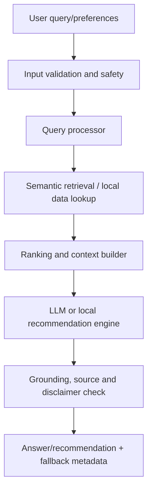

Pipeline chuẩn là **Input -> Validation -> Retrieval -> Ranking -> Context -> LLM/local engine -> Grounding -> Response**. AI không được tự thay đổi order, payment, stock, quyền hoặc dữ liệu người dùng. Khi provider không khả dụng, response phải nêu `fallback: true` hoặc mã tương đương.

## 39. System Limitations

- Recommendation phụ thuộc chất lượng, độ mới và độ phủ của dữ liệu lab/package.
- AI provider có thể giới hạn quota, latency, chi phí hoặc ngừng khả dụng.
- Image quality hiện là heuristic dựa trên pixel, không đánh giá đầy đủ nội dung nghệ thuật, màu phim hay chất lượng scan chuyên nghiệp.
- SSE là kênh server-to-client một chiều, không thay thế hệ thống chat hai chiều hoặc notification đa kênh.
- Payment production, escrow, refund và dispute chưa hoàn thiện nếu chưa cấu hình gateway tương ứng.
- Marketplace chưa bao gồm đầy đủ logistics, shipping verification và seller KYC.
- Upload file lớn có thể ảnh hưởng CPU/memory nếu chưa chuyển xử lý sang worker bất đồng bộ.
- Semantic search phụ thuộc việc indexing embedding và chất lượng knowledge documents.
- Một số state order hiện còn không thống nhất giữa model và route; phải migration trước production.

## 40. Appendix Index

Outline chính thức của tài liệu:

1. Introduction; 2. Overall Description; 3. System Scope; 4. User Roles; 5. Functional Requirements; 6. Use Case Specification; 7. System Workflows; 8. Non-Functional Requirements; 9. External Interface Requirements; 10. Data Requirements; 11. AI Requirements; 12. System Architecture; 13. Business Rules; 14. Security Requirements; 15. Acceptance Criteria; 16. Traceability Matrix; 17. Future Enhancements.

Các đặc tả mở rộng: 18. Permission Matrix; 19. Requirement Priority; 20. FR Contract; 21. UI Requirements; 22. Data Dictionary; 23. Error Handling; 24. State Transition; 25–40. Additional Specification and Appendices.

## Phụ lục A - API Reference

| Method | Path | Auth | Mô tả |
|---|---|---|---|
| POST | `/api/auth/register` | No | Đăng ký |
| POST | `/api/auth/login` | No | Đăng nhập |
| GET/PUT | `/api/auth/profile` | JWT | Profile |
| GET | `/api/film-labs`, `/api/film-labs/:id` | No | Lab discovery/detail |
| POST/PATCH | `/api/orders`, `/api/orders/:id/status` | JWT | Order lab |
| GET/PATCH | `/api/lab-management/*` | Owner/Admin | Lab operations |
| GET/POST/PUT/DELETE | `/api/marketplace/listings*` | Mixed | Listings |
| POST/PATCH | `/api/marketplace/orders*` | JWT | Marketplace orders |
| GET/POST | `/api/community/posts*` | Mixed | Posts/comments |
| GET/POST/PATCH | `/api/events/*` | Mixed | Event/registration |
| POST/GET/DELETE/PATCH | `/api/uploads/*` | JWT | Upload/archive |
| POST | `/api/ai/recommendations`, `/api/ai/semantic-search` | Mixed | AI recommendation/search |
| GET/POST | `/api/reviews`, `/api/messages` | JWT | Review/message |
| GET/POST/PATCH | `/api/transactions`, `/api/payments` | JWT/provider | Transaction/payment |
| GET/POST/PATCH | `/api/admin/*` | Admin | Administration |

## Phụ lục B - Database Schema

Các bảng chính: `users`, `film_labs`, `lab_services`, `lab_packages`, `orders`, `order_items`, `transactions`, `products`, `marketplace_orders`, `reviews`, `messages`, `posts`, `comments`, `uploads`, `favorites`, `workshops`, `photowalks`, `event_registrations`, `rag_documents`. Chi tiết cột, enum, khóa ngoại và index tham chiếu [docs/database-schema.md](database-schema.md).

## Phụ lục C - Glossary

| Thuật ngữ | Định nghĩa |
|---|---|
| Film lab | Đơn vị tráng/rửa, scan hoặc in phim |
| Package | Gói kết hợp nhiều dịch vụ lab |
| Booking/Order | Yêu cầu sử dụng dịch vụ và bản ghi giao dịch |
| Listing | Tin đăng sản phẩm marketplace |
| SSE | Server-Sent Events, kênh server đẩy cập nhật một chiều |
| RAG | Retrieval-Augmented Generation, sinh câu trả lời dựa trên tài liệu truy hồi |
| Embedding | Vector biểu diễn ngữ nghĩa của văn bản |
| Archive | Kho lưu trữ ảnh/scan và metadata của người dùng |
| IDOR | Lỗi truy cập object không được kiểm tra ownership |

## Phụ lục D - Current Implementation Status

| Area | Trạng thái | Ghi chú |
|---|---|---|
| Auth/JWT/profile | Hiện có | Reset email và OAuth còn dự kiến |
| Lab discovery/service/order | Hiện có prototype | Cần hợp nhất order state và validate giá server-side |
| Payment | Prototype/fallback | Stripe webhook/idempotency cần hoàn thiện |
| Lab management | Hiện có | Có dashboard và status endpoint |
| Marketplace | Hiện có prototype | Cần atomic stock transaction |
| Community/events | Hiện có prototype | Capacity/moderation cần hoàn thiện |
| Upload/image quality | Hiện có | MIME/security/blob hardening cần hoàn thiện |
| AI | Local fallback + provider tùy chọn | Cần evaluation, source/disclaimer và privacy controls |
| Admin/observability/testing | Một phần | Audit log, CI coverage và production monitoring cần bổ sung |

Các module backend và frontend đã có khung xử lý cho authentication, film labs, orders, lab management, marketplace, community, events, uploads, reviews, messages, transactions, payments, admin và AI. Những mục gắn **Dự kiến** là backlog bắt buộc hoặc điều kiện cần xác nhận trong giai đoạn hardening.

## Phụ lục E - Definition of Done for Production

Một yêu cầu chỉ được xem là hoàn thành production khi có implementation, test tự động phù hợp, kiểm tra quyền, logging/monitoring, tài liệu API/UI, xử lý lỗi và được nghiệm thu theo tiêu chí liên quan trong mục 15.
